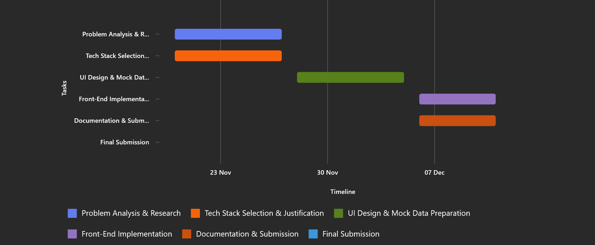

[](https://classroom.github.com/a/CRgtaUTR)


Github Repository Link:

https://github.com/CS-LTU/com4113-tech-stack-assessment-1-2025-26-TomBogdan?tab=readme-ov-file

*I have utilised version control to allow me to seamlessly roll back changes I have made and to give me a good*
*visualisation of what changes I have made over a certain timespan*


# README

## Project Overview:

Skill Swap Hub is a community-driven platform where users can share their hobbies, skills, and resources. The goal is to create a space for collaborative learning and knowledge exchange.


**Features:**
- User registration and profile creation
- Share resources (links, tutorials, tools)
- Categorised resources by hobbies
- Basic search and filter functionality
- Responsive design for desktop and mobile


## Choice of Tech Stack

My initial thoughts on what tech stack I was going to utilise were that LAMP seemed like a good choice due to the fact
that I am already mostly familiar with Linux as an operating system.

However, MEAN seemed particularly attractive as it is very JS heavy. Angular also seemed to me to be a good technology to use especially given its synthesis with Node.js and Express.js. My research had told me that MEAN is good for simplifying
web development, which I found to be an attractive trait due to my limiting timeframe.

Once I had researched more I found that React seems to be the better service to use for Front-End javascript development, given its lightweight nature and simplicity. Therefore my choice of Tech Stack was MERN due to its much more shallow learning curve.  


## Project Planning

Initially my main goal was to reach the MVP and then work on from there, refining and creating a much sleeker more seamless product. I knew from the start that I wanted a minimal but elegant design scheme, using simple colours such as White and Blue to give the WebPage a refined but welcoming design. My next goal was to add more features that allowed for an easier and more enjoyable user experience, I implemented high levels of customisability to allow a user to shape their profile and their posts to be what they want them to be. 

My long term vision for the project is for it to be a place where users feel safe and where they can discuss their hobbies, skillls and other things they enjoy with other users and that, in time, the Skill Swap Hub would become a site that large numbers of users use frequently for their own enjoyment.

## Installation Intructions


Before you begin, ensure you have the following installed:

- [Node.js (v18+)](https://nodejs.org/en/download/)
- npm (comes with Node.js)
- [Git](https://git-scm.com/downloads)
- [Visual Studio Code](https://code.visualstudio.com/)
- A modern browser (Chrome or Firefox)


Check versions:
```bash
node -v
npm -v
```

### Step 1

Once all associated files are installed, run the command:
```
cd skill-swap-hub
```
This ensures that you are running commmands in the right folder, rather than simply within the Development Environment


### Step 2

Once in the right folder, run this command to start the Node Server:
```
npm start
```

### Step 3 

The WebPage should open in your browser under the url: http://localhost:3000

The WebPage should be fully interactable and fully functioning

###  Common Issues & Fixes

**Port already in use**:
Kill the process which is using port 3000.
Do NOT run this site on any port other than 3000, this will reduce functionality and cause parts of the site to not work.

**"npm error Missing script: "start""**:
Ensure you have used 'cd skill-swap-hub' in the terminal before running any npm commands

### Issues I Faced

I faced isues with learning to use Node.js and React.js for the first time, despite the relatively shallow learning curve I still struggled near the start of the project. However, over time I became more confident with using Node.js and React.js and therefore was able to make my project work. 

For some issues I used Microsoft Copilot 365 for advice and assistance in fixing the issues I faced.

## Project Plan



The Gantt chart illustrates the timeline for key tasks and milestones from 20 November to 12 December 2025, ensuring structured progress towards the MVP and submission deadline.

I decided that it would be best to work around my Uni work and lectures whilst working on this project. This meant I was able to
allocate appropriate time and effort to each.

Now that there has been a week added to the deadline, my workload has eased, I am still allocating enough time to work however.

### Milestones

Week 1–2: UI design and mock data setup

Week 3–4: Implement core pages (Home, About, Contact)

Week 5: Add resource sharing and search functionality

Week 6: Testing and documentation

## User Journey

**Home Page**: Browse Resources by searching or sorting for them. Navbar at the top is to help guide to other parts of the page.

**Profile Page**: View your profile and edit where you see fit.

**Create Profile Page**: Create a profile, or create a new profile if you have one already.

**Share Resource Page**: Share a resource with a Title, Description, Category and a Link.

**About Us Page**: Information about the Skill Swap Hub and the goals of the site.

**Contact Us Page**: A way for the user to contact an admin for support on the site.

The site was designed with ease of access in mind.

## Legal & Ethical Considerations

When a backend is implemented I will have to comply with GDPR rules and regulations when it comes to storing user data and keeping it secure.
Handling of authentication and personal information will also have to maintain the utmost security.
I would also have to consider the legal implications of the user's freedom to discuss what they choose to on the site.

## Risk Assessment

**Risk**: Data breach

**Mitigation**: Use HTTPS and secure authentication


**Risk**: Downtime during deployment

**Mitigation**: Test builds locally before deployment

## Future Scaling

- **Add backend with database (e.g., MongoDB)**
- **Implement AI-based recommendations**
- **Enable resource bookmarking and advanced search**
- **Add more advanced data handling**

&nbsp;

*This assignment used generative AI in the following ways for the purposes of completing the
assignment; research, planning and editing.*